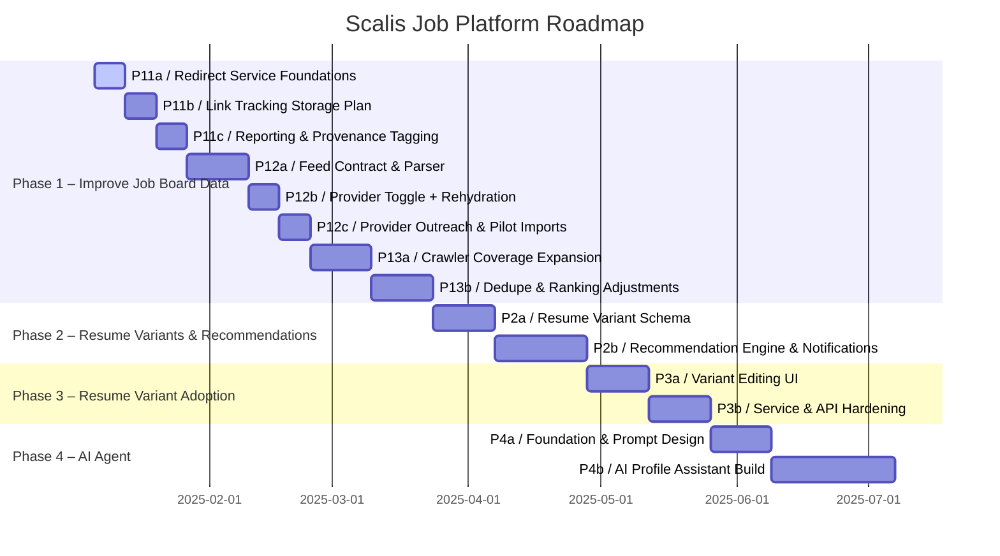

# Scalis Job Platform Gantt

> Durations are indicative and give room for overlap where support teams can push in parallel. See `roadmap-plan.md` for the full narrative.

```mermaid
gantt
    dateFormat  YYYY-MM-DD
    title Scalis Job Platform Roadmap

    section Phase 1 – Improve Job Board Data
    P11a / Redirect Service Foundations       :active, p11a, 2025-01-06, 1w
    P11b / Link Tracking Storage Plan         :p11b, after p11a, 1w
    P11c / Reporting & Provenance Tagging     :p11c, after p11b, 1w
    P12a / Feed Contract & Parser             :p12a, after p11c, 2w
    P12b / Provider Toggle + Rehydration      :p12b, after p12a, 1w
    P12c / Provider Outreach & Pilot Imports  :p12c, after p12b, 1w
    P13a / Crawler Coverage Expansion         :p13a, after p12c, 2w
    P13b / Dedupe & Ranking Adjustments       :p13b, after p13a, 2w

    section Phase 2 – Resume Variants & Recommendations
    P2a / Resume Variant Schema               :p2a, after p13b, 2w
    P2b / Recommendation Engine & Notifications     :p2b, after p2a, 3w

    section Phase 3 – Resume Variant Adoption
    P3a / Variant Editing UI                  :p3a, after p2b, 2w
    P3b / Service & API Hardening             :p3b, after p3a, 2w

    section Phase 4 – AI Agent
    P4a / Foundation & Prompt Design          :p4a, after p3b, 2w
    P4b / AI Profile Assistant Build          :p4b, after p4a, 4w
```

